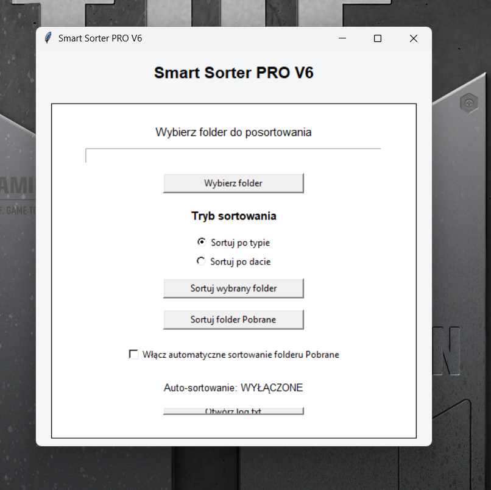
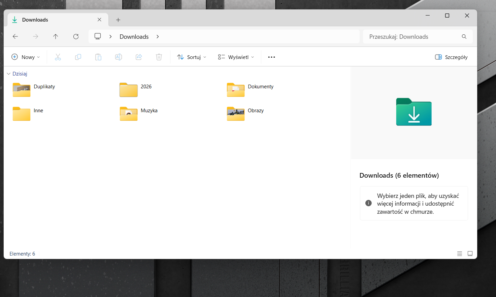
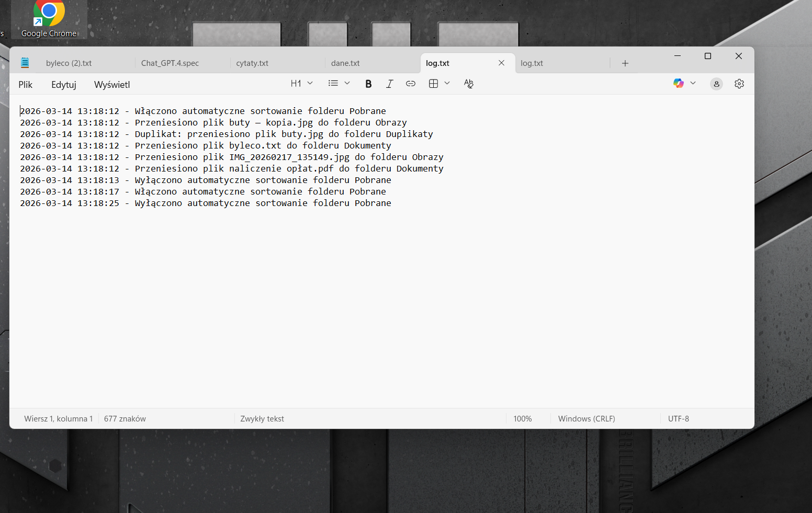
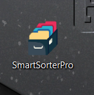

# Smart Sorter PRO

Smart Sorter PRO is a Windows desktop app that automatically organizes files in a selected folder or in the **Downloads** folder.

The program can:

- sort files by **type**
- sort files by **date**
- detect **duplicates**
- save operation history to **log.txt**
- run in **auto-sorting mode**
- remember the last selected folder and sorting mode

## Features

- automatic file sorting by type
- automatic file sorting by date
- auto-sorting of the Downloads folder
- duplicate detection based on file content
- operation history saved to `log.txt`
- settings saved in `settings.json`
- standalone `.exe` version for Windows

## Main app window



## Sorting results



## Log file



## App icon



## How it works

The user launches the app, selects a folder or chooses the **Downloads** folder, and then decides whether files should be sorted by **type** or **date**.

The program automatically:

- creates the correct folders
- moves files into the right categories
- detects duplicates and moves them into the **Duplikaty** folder
- saves all actions to `log.txt`

## Example folders created by the app

### Sort by type
- Obrazy
- Dokumenty
- Wideo
- Muzyka
- Inne
- Duplikaty

### Sort by date
- 2026
  - 03-March
- 2025
  - 11-November

## Installation

### EXE version
1. Download `SmartSorterPro.exe`
2. Run the application on Windows
3. Choose a folder or use the **Sort Downloads folder** option

### Python version
1. Install Python 3.11+
2. Run:

```bash
python smart_sorter_pro.py
